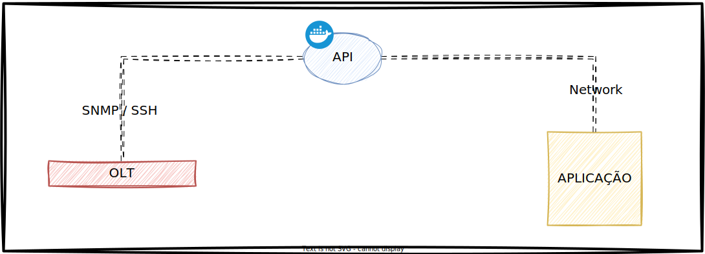

# SC OLT Intelbras 8820i

> EM CONSTRUÇÃO 🏗️🔥

___

___

## Help
-[Site - OLT 8 portas GPON](https://www.intelbras.com/pt-br/olt-8-portas-gpon-olt-8820-i)

## OID's

### Monitoramento geral

| Descrição                         | OID                               | Retorno                              |
|-----------------------------------|-----------------------------------|--------------------------------------|
| cpuUsage                          | .1.3.6.1.4.1.2021.11.9.0          | Porcentagem de Uso do CPU |
| memTotal                          | .1.3.6.1.4.1.2021.4.5.0           | Memória RAM total em KBytes |
| memFree                           | .1.3.6.1.4.1.2021.4.6.0           | Memória RAM Livre em KBytes |
| uptime                            | .1.3.6.1.2.1.1.3.0                | Tempo online do sistema |
| systemStatusSensor1Temperature    | .1.3.6.1.4.1.26138.1.5.1.1.0      | Temperatura medida do sensor de temperatura 1 em °C |
| systemStatusSensor2Temperature    | .1.3.6.1.4.1.26138.1.5.1.2.0      | Temperatura medida do sensor de temperatura 2 em °C |

### Monitoramento das ONUs

| Descrição                  | OID                                     | Retorno                                                                                                                             |
|----------------------------|-----------------------------------------|-------------------------------------------------------------------------------------------------------------------------------------|
| onuStatusIndex             | .1.3.6.1.4.1.26138.1.2.1.1.1.1          | Existe um ID fixo para as 1024 ONUs... Valor 129 = GPON 2 ONU 1. Valor 257 = GPON 3 ONU 1. |
| onuStatusPort              | .1.3.6.1.4.1.26138.1.2.1.1.1.2          | A porta da OLT na qual a ONU está conectada... Exemplo: .1.3.6.1.4.1.26138.1.2.1.1.1.2.1 = 1 e .1.3.6.1.4.1.26138.1.2.1.1.1.2.1024 = 8 |
| onuStatusOnuId             | .1.3.6.1.4.1.26138.1.2.1.1.1.3          | ID da ONU na porta PON |
| onuStatusRegistered        | .1.3.6.1.4.1.26138.1.2.1.1.1.4          | Status do registro da ONU no sistema. 1 = posição ocupada, 2 = posição livre. |
| onuStatusActive            | .1.3.6.1.4.1.26138.1.2.1.1.1.5          | Status da ONU. 1 = ONU Ativa, 2 = ONU Inativa. |
| onuStatusSerialNumber      | .1.3.6.1.4.1.26138.1.2.1.1.1.6          | O Serial number da ONU |
| onuStatusOmciStatus        | .1.3.6.1.4.1.26138.1.2.1.1.1.7          | Status do OMCI da ONU. 2 = ok, 0 = Inativo. |
| onuStatusOltRxPower        | .1.3.6.1.4.1.26138.1.2.1.1.1.8          | Sinal de RX da OLT. Exemplo: -24.80. |
| onuStatusOnuRxPower        | .1.3.6.1.4.1.26138.1.2.1.1.1.9          | Sinal de RX da ONU. Exemplo: -24.80. |
| onuStatusAlarms            | .1.3.6.1.4.1.26138.1.2.1.1.1.10         | String com os alarmes ativos da ONU. |
| onuStatusModel             | .1.3.6.1.4.1.26138.1.2.1.1.1.11         | String com o modelo da ONU |
| onuStatusVersion           | .1.3.6.1.4.1.26138.1.2.1.1.1.12         | String com a versão de firmware ativa da ONU. |
| onuStatusOnuDescription    | .1.3.6.1.4.1.26138.1.2.1.1.1.13         | Informa a descrição da ONU. |
| OnuTraps                   | .1.3.6.1.4.1.26138.1.2.2                | Traps das ONUs |
| onuDown                    | .1.3.6.1.4.1.26138.1.2.2.1              | Trap que indica que a ONU está down. |
| onuUp                      | .1.3.6.1.4.1.26138.1.2.2.2              | Trap que indica que a ONU está ativa. |
| portStatsActiveOnus        | .1.3.6.1.4.1.26138.1.4.1.1.1.55         | Apresenta a quantidade de CPE’s ativas na interface PON. Exemplo: .1.3.6.1.4.1.26138.1.4.1.1.1.55.9 = GPON 1 e .1.3.6.1.4.1.26138.1.4.1.1.1.55.16 = GPON 8 |
| portStatsConfiguredOnus    | .1.3.6.1.4.1.26138.1.4.1.1.1.56         | Apresenta a quantidade de CPE’s configuradas na interface PON. Exemplo: .1.3.6.1.4.1.26138.1.4.1.1.1.56.9 = GPON 1 e .1.3.6.1.4.1.26138.1.4.1.1.1.56.16 = GPON 8 |

### Monitoramento dos SFPs

| Descrição                | OID                               | Retorno                                                                                                  |
|--------------------------|-----------------------------------|----------------------------------------------------------------------------------------------------------|
| sfpStatusIfIndex         | .1.3.6.1.4.1.26138.1.1.1.1.1.1    | Existe um ID fixo para todas as portas SFP... Esse ID retornado deve ser utilizado nas consultas abaixo. |
| sfpStatusIfName          | .1.3.6.1.4.1.26138.1.1.1.1.1.2    | O nome da interface que o ID representa. |
| sfpStatusIfIsPresent     | .1.3.6.1.4.1.26138.1.1.1.1.1.3    | Valida se a interface tem um módulo ativo. 1 = ativo, 2 = inativo. |
| sfpStatusIfVendor        | .1.3.6.1.4.1.26138.1.1.1.1.1.4    | Retorna a string com o nome do Vendor do SFP. |
| sfpStatusIfPartNumber    | .1.3.6.1.4.1.26138.1.1.1.1.1.5    | Retorna o SFP Part Number. |
| sfpStatusIfTemperature   | .1.3.6.1.4.1.26138.1.1.1.1.1.6    | Retorna a temperatura do módulo SFP. |
| sfpStatusIfVoltage       | .1.3.6.1.4.1.26138.1.1.1.1.1.7    | Retorna a voltagem do SFP. |
| sfpStatusIfTxBias        | .1.3.6.1.4.1.26138.1.1.1.1.1.8    | Informação do SFP Tx Bias current. |
| sfpStatusIfTxPower       | 1.3.6.1.4.1.26138.1.1.1.1.1.9     | Informação da potência de TX dp módulo SFP. |
| sfpStatusIfRxPower       | .1.3.6.1.4.1.26138.1.1.1.1.1.10   | Informação do sinal de RX recebido pelo módulo SFP. |
